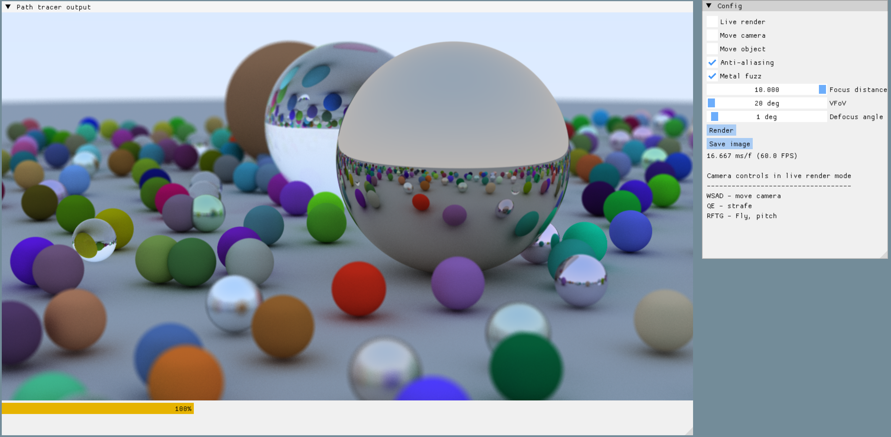

# About the project

This is the code I wrote while following the book **[Ray tracing in one weekend](https://raytracing.github.io/books/RayTracingInOneWeekend.html)**.

The rendering code is almost exactly as described in the book. Nothing novel here. The code is perhaps a bit more structured than the book suggests and I have changed some names and conventions to fit my preference a bit better.

I have taken a liberty to use some libraries that I wanted to learn, namely:

* ImGUI
* Eigen
* libpng

This means the code is a bit simpler (all the matrix math is not implemented but using Eigen instead), allows rendering into png, and some extra features were added thanks to ImGUI:

* Standalone window that presents the result instead of always generating a file.
* Configuration dialog that allows experimenting with some options and seeing the result right away.
* Real time rendering mode which samples less rays per pixel but can visualize camera and object motion.

# Building

The project was ejected from CLion with the Conan plugin. This means it's pretty much vanilla cmake, but needs conan installed and some arguments to work.

> cmake -B .build -S . -G Ninja -DCMAKE_PROJECT_TOP_LEVEL_INCLUDES=conan_provider.cmake -DCMAKE_BUILD_TYPE=Release

> cmake --build .build
